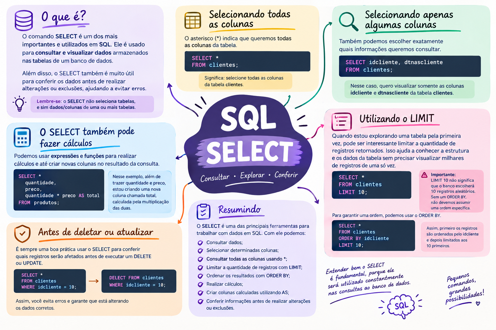

# SQL — Comando SELECT

O comando **SELECT** é um dos comandos mais importantes e mais utilizados em SQL. Ele é usado principalmente para **consultar e visualizar dados** armazenados nas tabelas de um banco de dados.

<!-- more -->

Além de consultar informações, o `SELECT` também é muito útil para **conferir os dados antes de realizar alterações ou exclusões**, ajudando a evitar erros.

### Selecionando todas as colunas

Por exemplo:

```sql
SELECT * FROM clientes;
```

Nesse caso, estou dizendo:

> "Selecione todas as colunas da tabela `clientes`."

O `*` significa **todas as colunas**.

### Selecionando apenas algumas colunas

Também posso escolher exatamente quais informações quero consultar:

```sql
SELECT idcliente, dtnascliente
FROM clientes;
```

Nesse caso, quero visualizar somente as colunas `idcliente` e `dtnascliente` da tabela `clientes`.

Isso é interessante porque nem sempre precisamos trazer todas as informações de uma tabela.

### Utilizando o LIMIT

Quando estou explorando uma tabela pela primeira vez, pode ser interessante limitar a quantidade de registros retornados.

Imagine que a tabela `clientes` tenha **5.000 registros**. Em vez de consultar todos eles, posso fazer:

```sql
SELECT *
FROM clientes
LIMIT 10;
```

Assim, o banco retornará **no máximo 10 registros**.

O `LIMIT` pode ser muito útil para conhecer a estrutura e os dados de uma tabela sem precisar visualizar milhares de registros de uma só vez.

> ⚠️ Importante: `LIMIT 10` não significa que o banco escolherá 10 registros aleatórios. Sem utilizar um `ORDER BY`, não devemos assumir uma ordem específica para os registros retornados.

Por exemplo, se eu quiser os 10 primeiros clientes de acordo com o `idcliente`, posso fazer:

```sql
SELECT *
FROM clientes
ORDER BY idcliente
LIMIT 10;
```

Nesse caso, primeiro os registros são ordenados pelo `idcliente` e depois limitados aos 10 primeiros.

### O SELECT também pode fazer cálculos

O `SELECT` não serve apenas para consultar colunas que já existem na tabela. Também podemos utilizar **expressões e funções para realizar cálculos e até criar novas colunas no resultado da consulta**.

Por exemplo:

```sql
SELECT 
    quantidade,
    preco,
    quantidade * preco AS total
FROM produtos;
```

Nesse caso, além de trazer `quantidade` e `preco`, estou criando uma nova coluna chamada `total`, calculada pela multiplicação das duas.

### Mapa mental



[:material-download: Baixar o mapa mental](../../assets/images/mapa-mental-select.png){ .md-button download="mapa-mental-select.png" }

### Resumindo

O `SELECT` é uma das principais ferramentas para trabalhar com dados em SQL. Com ele podemos:

- Consultar dados;
- Selecionar determinadas colunas;
- Consultar todas as colunas usando `*`;
- Limitar a quantidade de registros com `LIMIT`;
- Ordenar os resultados com `ORDER BY`;
- Realizar cálculos;
- Criar colunas calculadas utilizando `AS`;
- Conferir informações antes de realizar alterações ou exclusões.

Para quem está começando a estudar SQL, entender bem o `SELECT` é fundamental, porque ele será utilizado constantemente nas consultas ao banco de dados.
